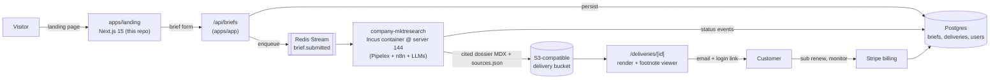

# 02 — Architecture

## System overview

OneWeekBrief is a research-as-a-service product. The customer-facing surface (this repo) is the *intake + delivery + billing* shell. The research engine itself runs as a separate Incus container (`company-mktresearch` on server 144) — that engine is the "factory floor" and is referenced but not duplicated here.

## Components (Wave 2 batch 1 scope)

| # | Component | Tech | Status (this batch) | Notes |
|---|-----------|------|---------------------|-------|
| 1 | `apps/landing` | Next.js 15 App Router, Tailwind, ShadCN-style primitives | **shipped** | Marketing site at `market-research-on-demand.prin7r.com` |
| 2 | `apps/app` | Forked from `wasp-lang/open-saas` | scaffolded folder, not configured | Becomes the Wasp dashboard in a later batch |
| 3 | Brief intake API | Wasp action + Postgres | deferred | Receives a one-paragraph brief, validates, charges |
| 4 | Engine bridge | n8n webhook → Pipelex graph in `company-mktresearch` | exists in `prin7r/auto-business-claude` | NOT rebuilt here |
| 5 | Delivery viewer | MDX renderer with footnote sidecar | deferred | Where the cited dossier lives |
| 6 | Subscription monitoring | Cron-triggered re-runs of saved briefs | deferred | Hooks into the same engine queue |

## Data flow — single brief

1. Customer submits a brief on `/brief` (landing form posts to a Wasp action in `apps/app`).
2. Stripe charge runs (`tier_one_off_499`, `tier_pro_1490`, `tier_monitor_2490_mo`).
3. On charge success, the Wasp action writes a `brief` row, emits `brief.submitted` to Redis Stream.
4. The `company-mktresearch` engine consumes from the stream, runs its Pipelex graph (planning → search → extract → cite-check → write → editor pass), writes a `cited.mdx` artifact + `sources.json` to S3.
5. The engine PATCHes the `brief` row to `status=delivered` with the artifact URL.
6. Customer gets a magic-link email; the dashboard renders the dossier with the inline footnote sidecar.

## Deploy topology

- **Landing** (this Wave 2 build): containerized Next.js standalone, deployed to `storage-contabo` (`161.97.99.120`) behind `dokploy-traefik` with a Let's Encrypt cert.
- **Dashboard / API** (deferred): the Wasp app will deploy to a separate Coolify project on the same host or to server 144.
- **Engine**: `company-mktresearch` Incus container on `144.91.94.91` — already running.
- **Storage**: Cloudflare R2 (no separate egress cost for the cited dossiers).
- **DNS**: wildcard `*.prin7r.com → 161.97.99.120` covers this subdomain.

## Quality / SLO

- Landing TTFB ≤ 250ms p95 from EU/US.
- Lighthouse perf ≥ 90, a11y ≥ 95, best-practices ≥ 95.
- Deliverable SLA: 24h Pro, 72h Standard. Engine is dimensioned to hold both at the current pipeline volume.
